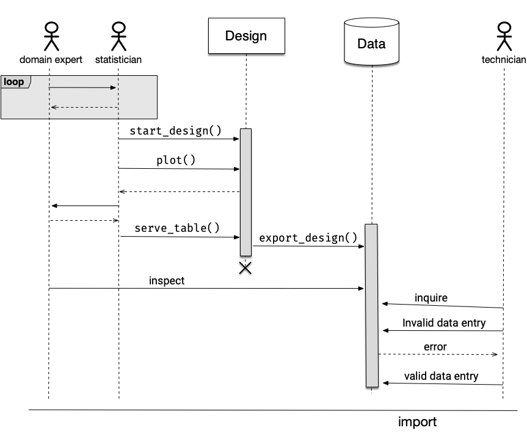

```{r setup, include=FALSE}
library(nomnoml)
knitr::opts_chunk$set(echo = FALSE,
                      fig.align = "center")
```

A **sequence diagram**, as described in [wikipedia](https://en.wikipedia.org/wiki/Sequence_diagram), shows objects interactions arranged in time sequence.  One of the standards for drawing this is using the **Unified Modelling Language** (UML) managed by the Object Management Group (OMG). 

UML was developed in the field of software engineering to provide a standard way to visualise the design of a system. It's a language that describes standards for all sorts of diagrams, not just the sequence diagram, e.g. communication diagram, interaction overview diagram and so on. 

The interaction of _actors_ with the system depicted as _objects_ with passage of time depicted as a vertical dotted line (a.k.a. lifeline) seemed like a good fit to use for illustrating the concept of [edibble](https://edibble.emitanaka.org/).

## Omnigraffle

I always find drawing complicated diagrams to be tricky via programming so I initially drew the diagram using OmniGraffle. There were some UML stencils and I thought it was going well (result in Figure \@ref(fig:omni)). Aligning the objects as a sequence diagram, even with OmniGraffle's precise object placement, was a bit difficult but it got the job done in the end. 

```{r omni, fig.cap="Drawn using OmniGraffle"}

```

Then I wanted to change and reorder some elements of the diagram. It's already taken me half a day to make a Figure \@ref(fig:omni), I really didn't want to repeat the process. Surely, there must be another tool that will make this easier? 

## Online tools

And thus began my journey (and what felt like a rabbit hole) in finding other tools to draw a sequence diagram. I found several online mapping solutions including [Lucidchart](https://www.lucidchart.com/pages/examples/uml_diagram_tool) and [Visual Paradigm](https://online.visual-paradigm.com/diagrams/features/uml-tool/) but it wasn't what I was after. Eventually I came across [GitMind](https://gitmind.com/). It was the most promising to me: it has a nice user interface, the features that I want and it happened to be completely free! It was easier than OmniGraffle to make sequence diagrams. You can find the result of the drawing in Figure \@ref(fig:gitmind).

```{r gitmind, fig.cap="Drawn using GitMind."}
knitr::include_graphics("seq-diagram-eg.png")
```

One thing to keep in mind is that the font for the PDF version is not rendered correctly. This is perhaps I've chosen a font available only in my system ("Fira Code").

Okay, looks like I'm good with this. Let's use this in the edibble documentation... Wait the interaction between the _statisitican_ and _Design_ doesn't fit the narrative well, I need to modify the diagram again!

This was a point when I realise I really need to programmatically create the diagram. Being somewhat of an anti click-and-point statistical software, I should have perhaps pursued the programmatic route earlier. 

## R

The most comprehensive R-package to draw a diagram is [DiagrammeR](https://rich-iannone.github.io/DiagrammeR/). When you go to the website (which has an impressively interface) it has the tagline "Sometimes You Want To Create Nice Diagrams: WHY NOT DO THAT WITH R?". That's a good question to ask past Emi.

### DiagrammeR

Under the hood, DiagrammeR it's powered by **Graphviz** and **mermaid**. [Sequence diagrams are supported by mermaid](https://mermaid-js.github.io/mermaid/#/sequenceDiagram) but there seems to be no distinguishment between an actor and an object. It seems like you always have to a message when actor/object is interacting.

```{r mermaid, echo = TRUE, fig.cap = "Drawn using mermaid via DiagrammeR"}
DiagrammeR::mermaid("
sequenceDiagram
    domain expert->>statistician: consult
    statistician-->>domain expert: query
    statistician->>Design: start_design()
    statistician->>Design: set_units()")
```

It's fairly good and you can further customise the look using CSS, but it doesn't have the actor symbol and some other standard UML symbols, it will be too much effort by me to recreate what I made using GitMind.

### nomnoml

```{r nomnoml, fig.cap="Drawn using nomnoml.com"}
knitr::include_graphics("nomnoml.png")
```

The [nomnoml R-package](https://github.com/rstudio/nomnoml) describes itself as a Sassy UML Diagrams for R. It's powered by the [nomnoml tool](https://nomnoml.com/) which has a nice simple website to create the diagrams you want. I quite enjoy using the website version where the graph renders instantenously using a simple syntax. The graph made using the web (Figure \@ref(fig:nomnoml)) is different to the one produced via R shown below along with the nomnoml syntax. 


```{nomnoml, echo = TRUE, fig.cap="Drawn using nomnoml"}
[<actor>domain expert] -- [<hidden> fin1]
[<actor>statistician] -- [<hidden> fin2]
[design] -- [<end> end]
[<database> data] -- [<hidden> hid]
[<actor>technician] -- [<hidden> fin3]
```

It turns out thought that the nomnoml [doesn't support sequence diagrams](https://github.com/skanaar/nomnoml/issues/1) and it doesn't look like it will support it any time either. 

### plantuml

I came across another R-package for UML diagrams called [plantuml](https://github.com/rkrug/plantuml). It's powered by the the [plantUML tool](https://plantuml.com/) which has a [extensive support for a sequence diagram](https://plantuml.com/sequence-diagram) (yes!). 

This one is not on CRAN yet. I initially had trouble getting it to work but managed to work re-installing GraphViz. I could get the example code to work but the code for sequence diagram didn't work for me so I used the online version of plantUML directly. 

I expanded a lot more than previous graphs with plantUML code below. The problem I realise now is that the image has become too big and too much text to be concise. So I'll have to tweak some more (when does this end?). At least now making an adjustment isn't hard this time!

```
@startuml
actor "domain expert" as expert #fff
actor statistician as stat #AD0059
participant design as design #fff
database data as data #fff
actor technician as tech #fff
== Conceptualizing the experiment ==
group Consultation
expert -> stat: I want to test which wheat variety is best
stat -> design: library(edibble)\nstart_design(name = "wheat")
activate design
stat -> design: set_context(aim = "identify best variety")
stat -> expert: What varieties are you testing?
expert -->> stat: I'm testing Mace and RockStar
stat -> design: set_trts(var = c("Mace", "RockStar"))
expert -->> stat: I have a field with 20 plots each at Narrabri and\n10 plots at Roseworthy that I can use for testing
stat -> design: set_units(site = c("Narrabri", "Roseworthy"),\n.               plot = nested_in( site,\n                                    "Narrabri" ~ 20,\n                              "Roseworthy" ~ 10))
stat -> expert: What do you consider as "best"?
expert -> stat: For now, I just want to select one that'll give me\nthe highest yield.
stat -> design: set_rcrds(yield = plot)
stat -> expert: What's range of values do you expect for the yield?
expert -->> stat: Well it never goes over 10 tonnes per hectre in my fields!
stat -> design: expect_rcrds(yield = to_be_numeric( with_value( between = c(0, 10))))
stat -> expert: Do you have any restrictions in allocation of varieties at site or plots?
expert -->> stat: No.
stat -> design: allocate_trts(var ~ plot)
stat -> design: plot()
design -->> stat
stat -> expert: Well, this is my current understanding of the structure.\nHave I understood it correctly?
expert -->> stat: That looks right.
stat -->> expert: Okay I'll send the design when it's ready.
end 
stat -> design: **randomise_trts()**
stat -> design: serve_table()
design -> data: export_design()
activate data
deactivate design
stat -> design !!: end session
expert -> data: inspect
tech -> data: inquire
tech -> data: data entry
group opt [invalid entry]
data -->> tech: error
end
== Import data and analyse==
@enduml
```

```{r plantuml, fig.cap="Drawn using plantUML"}
knitr::include_graphics("seq-diag-uml.png")
```

In the end the solution wasn't quite R, but perhaps it will be when the plantuml package upgrades or other solutions are developed.