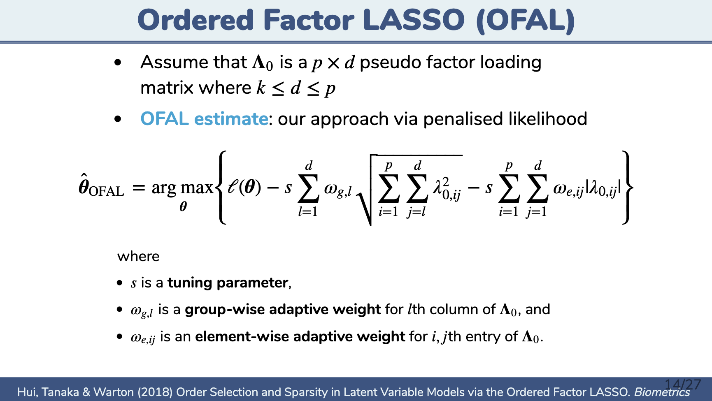

```{r setup, include=FALSE}
knitr::opts_chunk$set(echo = FALSE,
                      out.width = "100%",
                      out.extra="style='border:1px solid black;'")
```

Click [here](https://www.monash.edu/business/wombat2019) about WOMBAT2019.

Click below for the slide. 

<a href="`r rmarkdown::metadata$url`">
```{r}
knitr::include_graphics("cover.png")
```
</a>


```{r}

```