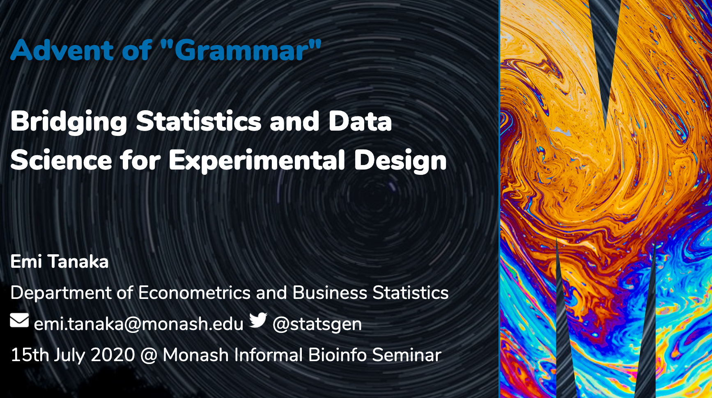
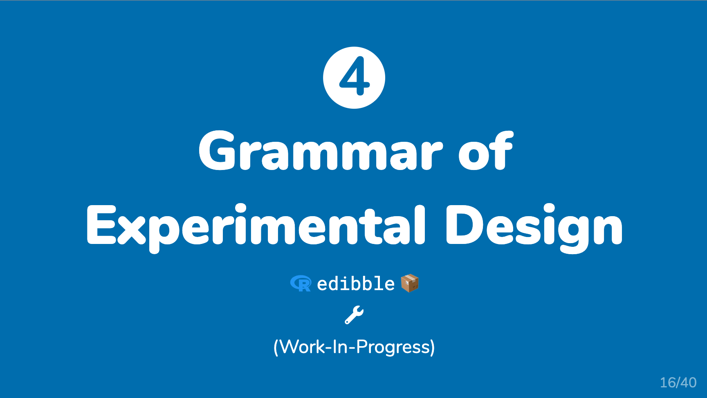

```{r setup, include=FALSE}
knitr::opts_chunk$set(echo = FALSE,
                      out.width = "100%",
                      out.extra="style='border:1px solid black;'")
```

Errata: there was an error in my script (where duplicates were not removed) for the count for the number of R packages in CRAN Task View of Design of Experiments. The slides specify there are about 200 R-packages. After removing duplicates, there was about 100 R-packages. 

*Click below for the slide.*

<a href="`r rmarkdown::metadata$url`">
```{r}

```
</a>


```{r}

```