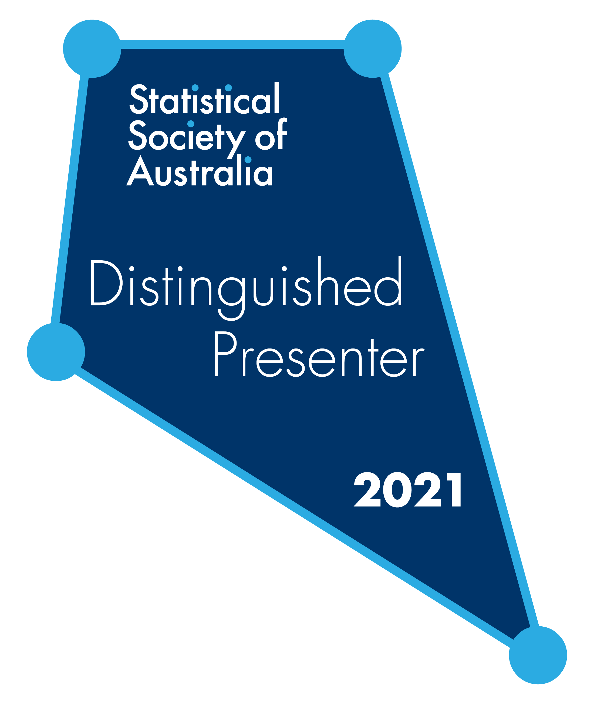

## Recent news
:::: news-container
::: news-item
### <i class="fas fa-newspaper"></i> Publications
[Nonextensive Local Composition Model for Excess Gibbs Energy of Electrolyte Systems (The 8th International Chemical Engineering Congress & Exhibition (IChEC 2014))]() by Hadis Rezaee

[A Nonextensive Electrolyte    UNIQUAC Model for Prediction of Mean Activity Coefficients of Binary Electrolyte Solutions(Iranian Chemical Society,  Phys. Chem. Res., Vol. 6, No. 4, 773-784, December 2018)]() by Hadis Rezaee

[Submitted a review paper of catalysts for Oxidative Coupling of Methane.]()
:::
::: news-item
### <i class="fas fa-comment"></i> Invited presentation 

<ul>
  <li>Lectured on downstream industries in oil and gas and hydrocracking technologies and Corrosion Under Insulation and Fireproofing.
I'll be presenting (in English) in the invited session at the 
[Mon 6th Sep 2021]{.date}</li>
</ul>
:::
::: news-item
### <i class="fas fa-chalkboard-teacher"></i> Research Interests

<ul>
  <li>Petroleum engineering</li>
  <li>	Oil and gas process</li>
  <li>Environmental engineering</li>
  <li>Heterogenous Catalysis</li>
  <li>Nanostructures</li>
  <li>Energy Transition</li>
  <li>Hydrocracking technology</li>
  <li>Process design and operation</li>
  <li>Electrolyte Solutions and Ionic Liquids</li>
</ul>
:::
::::

<a class="twitter-timeline" data-height="600" data-width="300"  href="https://twitter.com/rezaeehadis99/">Tweets by Hadis</a>

